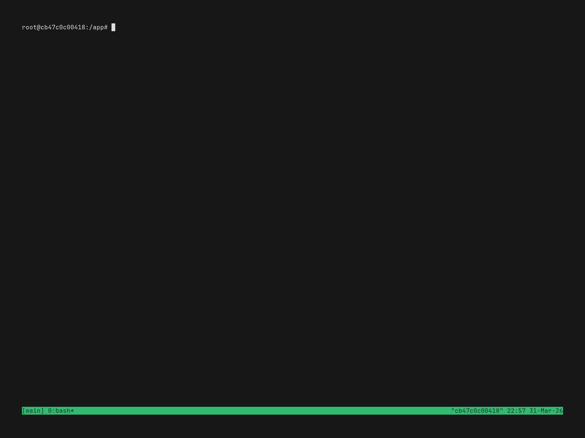

# lazyclaude

[English](README.md) | **日本語**

> [lazygit](https://github.com/jesseduffield/lazygit) にインスパイアされた、複数の [Claude Code](https://docs.anthropic.com/en/docs/claude-code) セッションを管理する TUI。

ライブプレビュー、権限プロンプトのポップアップ、スクロールバック閲覧、SSH リモートセッション -- すべてを一つの tmux popup から。

<p align="center">
  
</p>

---

## なぜ lazyclaude？

Claude Code は強力ですが、複数セッションの管理は大変です:

- **コンテキストの切り替え** -- 他のセッションの状況を見るには `tmux select-window` が必要
- **権限プロンプトがブロックする** -- 承認するには適切なウィンドウに適切なタイミングでいる必要がある
- **全体像がない** -- どのセッションが実行中、アイドル、入力待ちなのか分からない

lazyclaude は、全セッションを一覧表示し、権限プロンプトをポップアップとして配信し、どこからでも承認できる単一の TUI でこれらを解決します。

## 機能

**セッション管理**
- Claude Code セッションの作成、リネーム、削除、アタッチ
- セッション一覧を離れずに任意のセッションの出力をライブプレビュー
- プロジェクト単位の折りたたみ可能なツリー表示
- 終了したセッションを会話履歴付きで再開 (`lazyclaude sessions resume`)

**アクティビティ追跡**
- 全セッションのリアルタイム 5 段階ステータス:
  `?` 実行中 | `!` 入力待ち | `✓` アイドル | `✗` エラー | `×` 終了
- Claude Code hooks による自動更新（設定不要）

**権限プロンプト**
- ツール承認ポップアップがオーバーレイとして表示 -- ウィンドウ切り替え不要
- ワンキー承認: `1` 許可、`2` 常に許可、`3` 拒否
- 複数セッションが入力待ちの場合、`Up`/`Down` でポップアップを切り替え
- 二列行番号付きの diff プレビュー（追加/削除の色分け、スクロールバー対応）
- Write / Edit ツールの差分表示（unified diff をクリーンなインライン形式で表示）
- SSH トンネル経由でも動作

**フルスクリーンモード**
- Claude Code へのキーボード直接転送（透過パススルー）
- vim ライクなスクロールバックブラウザ（`Ctrl+V` またはマウスホイール）
- 行単位のビジュアル選択とクリップボードコピー（`v` で選択、`y` でコピー）

**MCP サーバー & プラグイン管理**
- Claude Code に登録された MCP サーバーの一覧表示と有効/無効の切り替え
- Claude Code プラグインのインストール、アンインストール、有効/無効を TUI から操作
- スコープ対応（プロジェクト / グローバル）

**検索とナビゲーション**
- fzf スタイルの `/` フィルター（セッション、プラグイン、MCP サーバーの各パネル対応）
- `?` Telescope スタイルのキーバインドヘルプオーバーレイ
- `Tab` / `Shift+Tab` でパネル切り替え

**PM/Worker マルチエージェント**
- PM（プロジェクトマネージャー）セッションを起動し、複数の Worker セッションを統括
- Worker は隔離された git worktree 上で独自ブランチを持って作業
- PM と Worker は組み込みメッセージ API（`/msg/send`、`/msg/create`）で通信
- 終了した Worker を再開し、中断箇所から作業を継続 (`sessions resume`)
- PM が Worker のプルリクエストをレビューし、構造化されたフィードバックを送信
- 各 Worker はロール、タスク、通信方法を含むシステムプロンプトを受け取る

**インフラ**
- `display-popup` 経由の tmux プラグイン統合（`Ctrl+\` でトグル）
- SSH リモートセッション（通知用の自動リバーストンネル）
- SSH_ASKPASS 統合によるパスワード認証対応
- Claude Code IDE 自動検出用の組み込み MCP サーバー
- TUI から [lazygit](https://github.com/jesseduffield/lazygit) を直接起動可能（オプション、インストール済みの場合）

---

## 要件

- tmux >= 3.4（`display-popup -b rounded` に必要）
- [Claude CLI](https://docs.anthropic.com/en/docs/claude-code)
- [lazygit](https://github.com/jesseduffield/lazygit)（オプション -- TUI 内での git 管理用）

## インストール

### クイックインストール（スタンドアロンバイナリ）

```bash
curl -fsSL https://raw.githubusercontent.com/any-context/lazyclaude/prod/install.sh | sh
```

ビルド済みバイナリを `~/.local/bin/` にダウンロードします。Go は不要です。`lazyclaude` で起動。

> **注意:** バイナリのみのインストールです。tmux プラグイン統合（`Ctrl+\` popup）を使うには、TPM またはリポジトリの clone を利用してください。

### [TPM](https://github.com/tmux-plugins/tpm) を使う場合（tmux プラグイン）

`.tmux.conf` に追加:

```tmux
set -g @plugin 'any-context/lazyclaude'
```

`prefix + I` でインストール。プラグインは `Ctrl+\` で lazyclaude を tmux popup として開くキーバインドを登録します。

### 手動 clone（TPM なしの tmux プラグイン）

```bash
git clone https://github.com/any-context/lazyclaude ~/.local/share/tmux/plugins/lazyclaude
cd ~/.local/share/tmux/plugins/lazyclaude
make install PREFIX=~/.local
```

`.tmux.conf` に追加:

```tmux
run-shell ~/.local/share/tmux/plugins/lazyclaude/lazyclaude.tmux
```

リロード: `tmux source ~/.tmux.conf`

### ソースからビルド

Go 1.25+ が必要:

```bash
git clone https://github.com/any-context/lazyclaude
cd lazyclaude
make install PREFIX=~/.local
```

---

## キーバインド

### セッションパネル

| キー | アクション |
|------|-----------|
| `j` / `k` | セッション間の移動 |
| `n` | 新規セッション作成 |
| `d` | セッション削除 |
| `Enter` | フルスクリーンモード |
| `a` | アタッチ（tmux 直接接続） |
| `R` | リネーム |
| `D` | 孤立セッションの一括削除 |

### フルスクリーンモード

| キー | アクション |
|------|-----------|
| `Ctrl+\` / `Ctrl+D` | フルスクリーン終了 |
| `Ctrl+V` / マウスホイール | スクロールモード開始 |
| その他のキー | Claude Code に転送 |

### スクロールモード（フルスクリーン内）

| キー | アクション |
|------|-----------|
| `j` / `k` | 1 行ずつスクロール |
| `J` / `K` / `PgUp` / `PgDn` | 半ページスクロール |
| `g` / `G` | 先頭 / 末尾にジャンプ |
| `v` | 行単位のビジュアル選択切り替え |
| `y` | 選択範囲をクリップボードにコピー |
| `Esc` / `q` | スクロールモード終了 |

### ポップアップ（権限プロンプト）

| キー | アクション |
|------|-----------|
| `1` | 許可 |
| `2` | 常に許可 |
| `3` | 拒否 |
| `Y` | 全ての保留中を許可 |
| `j` / `k` | コンテンツのスクロール |
| `Up` / `Down` | ポップアップ間の切り替え |
| `Esc` | ポップアップを非表示 |

### グローバル

| キー | アクション |
|------|-----------|
| `?` | キーバインドヘルプオーバーレイ |
| `/` | 現在のパネルで検索フィルター |
| `Tab` / `Shift+Tab` | パネルフォーカスの切り替え |
| `p` | 非表示のポップアップを復元 |
| `q` / `Ctrl+C` | 終了 |

---

## アーキテクチャ

```
+---------------------------+       +---------------------------+
|     ユーザーの tmux        |       |   lazyclaude tmux (-L)    |
|  (display-popup)          |       |   Claude Code セッション   |
|                           |       |                           |
|   +-------------------+   |       |   @0: session-1           |
|   | lazyclaude TUI    |<--+-------+-> @1: session-2           |
|   | (gocui)           |   |       |   @2: session-3           |
|   +--------+----------+   |       |                           |
|            |              |       +---------------------------+
|   +--------v----------+   |
|   | MCP Server        |   |       Claude Code hooks が POST:
|   | (in-process)      |<----------  /notify, /stop,
|   | 127.0.0.1:<port>  |   |        /session-start,
|   +-------------------+   |        /prompt-submit
+---------------------------+
```

hooks はセッション起動時に `claude --settings <file>` で注入されます。`~/.claude/settings.json` は変更されません。hooks は lock file スキャンで MCP サーバーを発見するため、サーバー再起動後も動作します。

---

## 開発

```bash
make build         # バイナリをビルド
make test          # 全テスト（race detector + カバレッジ）
make lint          # golangci-lint
make readme-gif    # docs/images/hero.gif を再生成（Docker 必須）
```

## 既知の問題

- **フルスクリーンモードでのペースト** -- フルスクリーンモードでのテキストペースト（Cmd+V / Ctrl+Shift+V）が正常に動作しない場合があります。tmux の `display-popup` と bracketed paste シーケンスの相互作用に起因する制限です。回避策: `a` でセッションに直接アタッチしてからペーストしてください。

## ロードマップ

- **マルチエージェント対応** -- Claude Code 以外のエージェント（Codex、Gemini CLI、カスタムエージェント等）のサポート
- **チャットビューワー** -- セッション間のメッセージ履歴（PM/Worker の会話）を閲覧するビルトインビューワー

欲しい機能がありましたら [Issue](https://github.com/any-context/lazyclaude/issues) でリクエストしてください。

## コントリビューション

コントリビューションを歓迎します！ バグ報告、機能リクエスト、プルリクエスト -- すべて大歓迎です。現在のタスクは [Issues](https://github.com/any-context/lazyclaude/issues) をご覧ください。

## ライセンス

MIT
