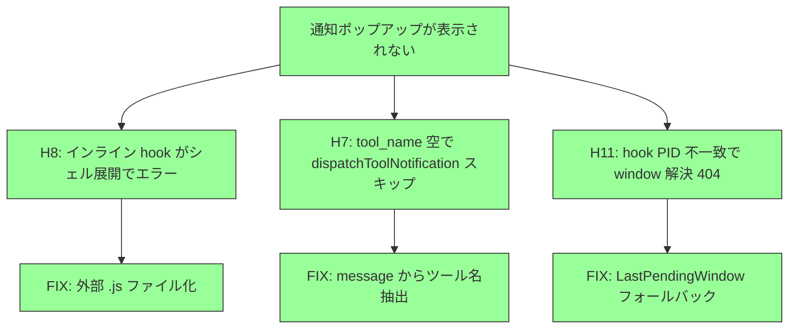

# SSH Notify デバッグ — 解決済み

**問題**: ssh_notify E2E テストで、リモート Claude Code の `Write` ツール使用時に lazyclaude の通知ポップアップが表示されない。

**解決**: 3つの修正で全チェーン動作確認。

## 修正まとめ

### Fix 1: インライン hook → 外部 .js ファイル (H8)
インライン `node -e "..."` のエスケープが Claude Code のシェル実行で壊れ、PreToolUse hook がエラー。
外部 `.js` ファイルに分離して解決。

0b7c270: refactor: extract hook commands to external .js files

### Fix 2: message からツール名抽出フォールバック (H7)
Claude Code の Notification JSON に `tool_name` が含まれない。
`message` フィールドの `"permission to use Write"` からツール名を抽出。

150ca11: fix: extract tool name from Notification message when PreToolUse absent

### Fix 3: PID フォールバックで window 解決 (H11)
SSH リモートでは PreToolUse と Notification の hook プロセスが別 PID で起動される。
Notification の PID でキャッシュヒットしないため 404。
最後に tool_info を受けた window にフォールバック。

e6ae4cf: fix: fallback to last pending window when permission_prompt PID differs

## 仮説マップ (最終)

## 棄却した仮説

- H0: hook POST 失敗 → Notification は 200 成功
- H1: IDE接続モードで hook スキップ → hook は発火していた
- H2: Sleep 不足 → 通知は到達済み
- H3: 認証 401 → 200 成功
- H4: Claude Code が自前 UI で処理 → hook は発火していた
- H5: lock file 読み取り失敗 → 正常読み取り
- H6: フルスクリーンで表示不可 → display-popup で表示成功
- H9: matcher 不一致 → hook は発火 (エラーだった)
- H10: console.log が応答を壊す → 削除しても効果なし (根本は別)

## 実験ログ

| コミット | 内容 | 結果 |
|---------|------|------|
| 0692ba1 | hook にログ出力追加 | Notification 発火確認、PreToolUse 0件 |
| 2374333 | stdin 全文ダンプ | Notification JSON に tool_name なし |
| 150ca11 | message からツール名抽出 | ポップアップ spawn 成功 (中身空) |
| 252fddd | console.log 削除 | PreToolUse エラー変わらず |
| 0b7c270 | 外部 .js ファイル化 | PreToolUse 成功、Notification 404 |
| 2578237 | 404 デバッグログ | PID 不一致確認 (407 vs 457) |
| e6ae4cf | LastPendingWindow フォールバック | 全チェーン成功、ポップアップ表示 |

## Issues

### Issue 1: display-popup exit status 129
`popup: spawn tool: display-popup: exit status 129 (stderr: )`
テスト終了時の SIGHUP でプロセスが kill される。テスト結果には影響なし。
