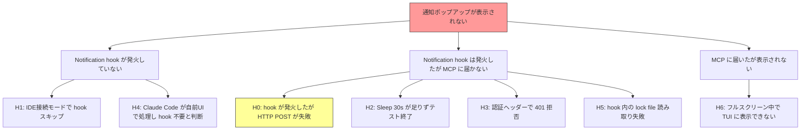

# SSH Notify デバッグ

**問題**: ssh_notify E2E テストで、リモート Claude Code の `Write` ツール使用時に lazyclaude の通知ポップアップが表示されない。

**事実**:
- サーバーログに `type=tool_info` (PreToolUse hook) は1件到達
- `permission_prompt` (Notification hook) は0件
- リバーストンネル自体は動作している (tool_info が届いている)

## 仮説マップ

## 仮説リスト

### H0: hook は発火したが HTTP POST が失敗している (未確認)
リモート側の hook 実行結果が一切確認できていない。hook はエラーを `catch{}` で握りつぶしている。まず hook にログ出力を追加し、発火有無・POST 結果を確認する。

**優先度: 最高 (他の仮説の前提)**

---

### H1: `CLAUDE_CODE_AUTO_CONNECT_IDE=true` で hook がスキップされる
IDE 接続モードでは Claude Code が permission_prompt を Notification hook ではなく WebSocket 経由で IDE に送る可能性。

---

### H2: テープの Sleep 30s が足りない
Notification hook の発火タイミングが Sleep 後でテスト終了。

---

### H3: 認証ヘッダーで 401 拒否
hook が送る authToken と MCP サーバーの期待するトークンが不一致。

---

### H4: Claude Code が自前 UI で許可ダイアログを表示し、Notification hook を発火しない
フルスクリーンのフレームに Claude Code の `Do you want to create hello.txt?` ダイアログが見えている。Claude Code が自分で処理完了とみなし Notification hook を発火しない。

---

### H5: hook 内の lock file 読み取り失敗
`~/.claude/ide/*.lock` のパスやパーミッションの問題で hook が lock file を見つけられない。

---

### H6: MCP に届いたがフルスクリーン中で表示できない
gocui Suspend 中は TUI のレンダリングが止まる。ただしサーバーログにも記録がないため、この仮説は現時点で棄却。

---

## 実験ログ

### 実験 1: hook にログ出力追加 (H0 検証)

