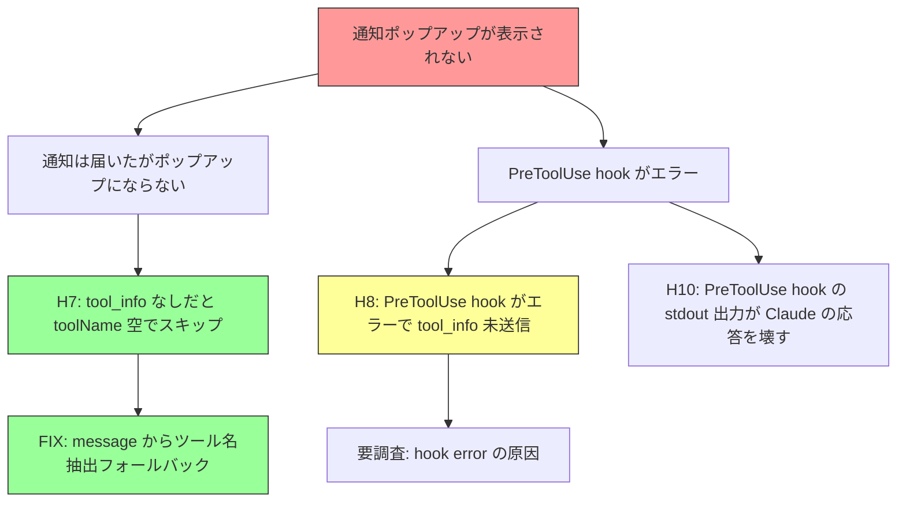

# SSH Notify デバッグ

**問題**: ssh_notify E2E テストで、リモート Claude Code の `Write` ツール使用時に lazyclaude の通知ポップアップが表示されない。

## 判明した事実

- Notification hook (permission_prompt) はリモートで発火し、MCP に到達 (200)
- PreToolUse hook はリモートで発火しているが **エラー** (`PreToolUse:Write hook error` がフレームに表示)
- Claude Code の Notification JSON に `tool_name` フィールドは含まれない
- `message` フィールドに `"Claude needs your permission to use Write"` がある
- `extractToolFromMessage` フォールバックで通知ポップアップ表示に成功

## 仮説マップ

## 仮説リスト

### ~~H0: hook が発火したが HTTP POST が失敗~~ → 棄却
実験1で確認: Notification hook は発火し POST 200 成功。

### ~~H1: IDE接続モードで Notification hook がスキップ~~ → 棄却
Notification hook は発火している。

### ~~H2: Sleep 30s が足りない~~ → 棄却
通知はサーバーに到達済み。

### ~~H3: 認証ヘッダーで 401 拒否~~ → 棄却
POST response: 200。

### ~~H4: Claude Code が自前UI で処理し Notification hook を発火しない~~ → 棄却
Notification hook は発火している。

### ~~H5: lock file 読み取り失敗~~ → 棄却
locks=["45979.lock"] で正常に読み取り。

### ~~H6: MCP に届いたがフルスクリーン中で表示できない~~ → 棄却
display-popup 経由でポップアップ表示成功 (実験3)。

### H7: tool_info なしの permission_prompt ではポップアップが出ない → 確定・修正済み
`resolveToolInfo` で `toolName=""` → `dispatchToolNotification` スキップ。
`extractToolFromMessage` フォールバックで修正。

150ca11: fix: extract tool name from Notification message when PreToolUse absent

### H8: PreToolUse hook がリモートでエラー → 確定・要調査
フレームに `PreToolUse:Write hook error` が表示。hook は発火しているがエラーで失敗。
remote-hook.log に PRETOOLUSE 行が0件 → hook のログ出力に到達する前にクラッシュしている可能性。
原因候補: node コマンドの構文エラー、パス問題、タイムアウト。

### ~~H9: PreToolUse hook の matcher が合わない~~ → 棄却
hook は発火している (エラーが出ている = matcher は通過)。

### H10: PreToolUse hook の stdout 出力が Claude の応答を壊す (要調査)
現在の PreToolUse hook は `console.log(d)` で stdin を stdout にエコーしている。
これが Claude Code に予期しない出力を返しエラーの原因になっている可能性。

---

## 実験ログ

### 実験 1: hook にログ出力追加 (H0 検証)
0692ba1: claude-settings.json に /tmp/lazyclaude-hook.log 出力追加、entrypoint.sh でリモート hook ログ回収

**結果**: Notification hook 発火確認、POST 200。PreToolUse 発火なし (ログ 0行)。H0,H1,H2,H3,H4,H5 棄却。

### 実験 2: stdin 全文ダンプ (H7 検証)
2374333: stdin の slice(0,200) を除去、フル出力

**結果**: Notification JSON に `tool_name` なし。`message` に `"use Write"` あり。H7 確定。

### 実験 3: message からツール名抽出 (H7 修正)
150ca11: extractToolFromMessage フォールバック追加

**結果**: サーバーログに `popup: spawning tool Write` 出現。ポップアップ表示成功。
ただし `display-popup: exit status 129` も発生。
フレームに `PreToolUse:Write hook error` を発見 → H8 確定。

---

## Issues

### Issue 1: PreToolUse hook がリモートでエラー
フレームに `PreToolUse:Write hook error`。remote-hook.log に PRETOOLUSE 行なし。
hook の Node.js コードがログ出力前にクラッシュしている可能性。
ログ付き hook が Docker イメージに正しく反映されているか要確認。

### Issue 2: display-popup exit status 129
`popup: spawn tool: display-popup: exit status 129 (stderr: )`
Signal 1 (SIGHUP) で kill されている。テスト終了時のクリーンアップが原因の可能性。
